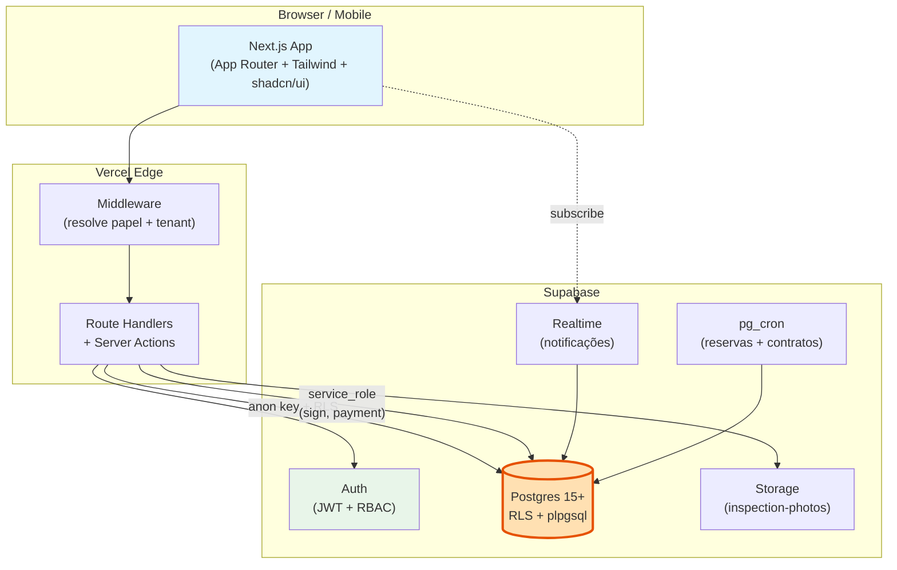
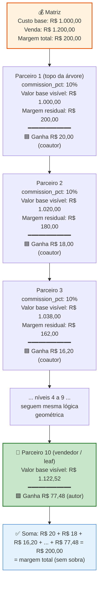
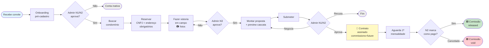
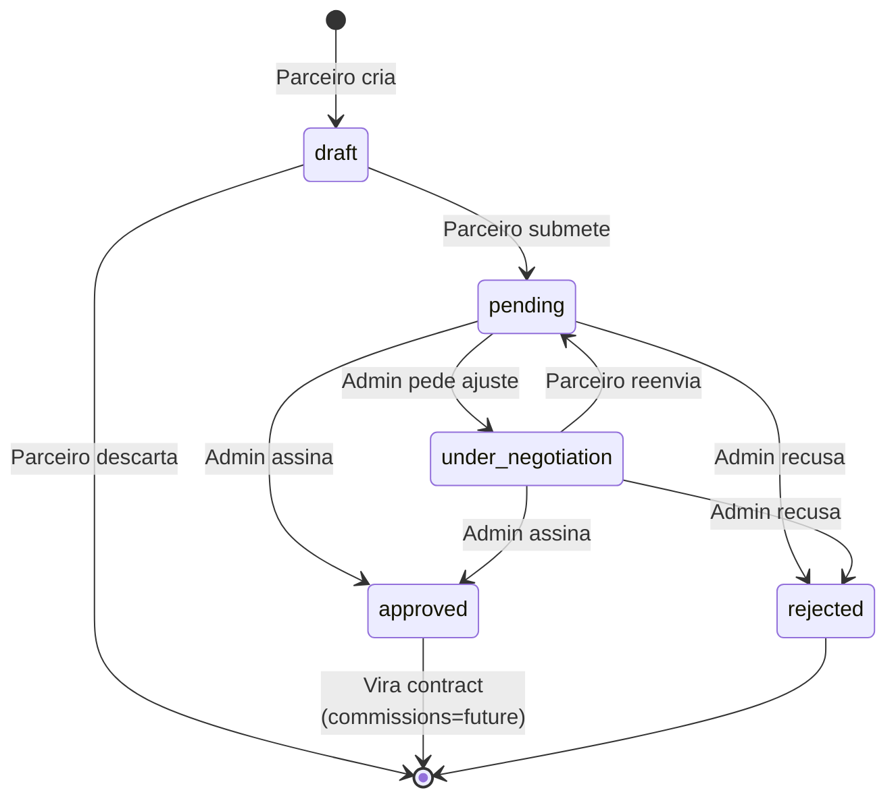
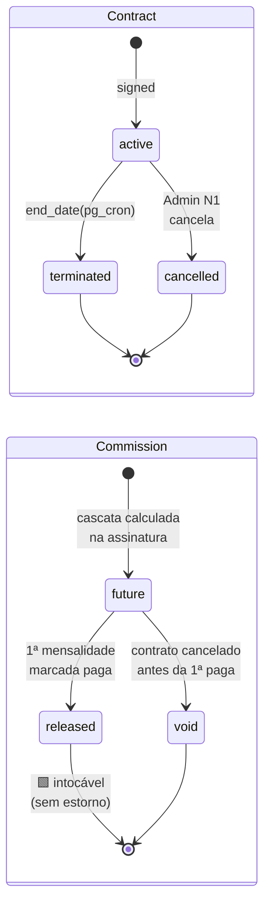
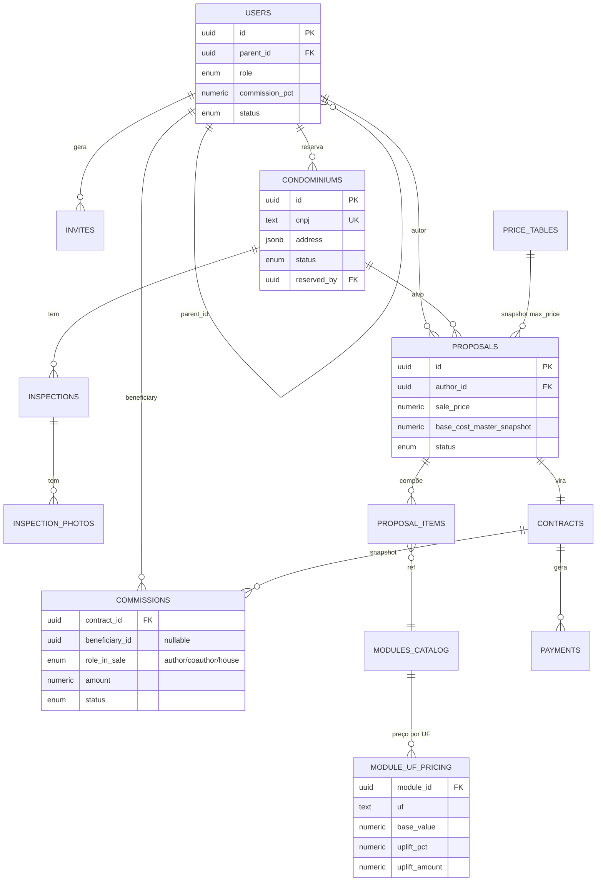
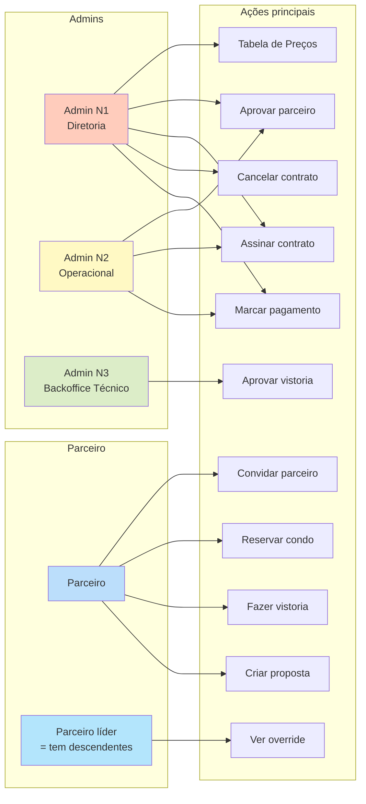

# Diagramas Visuais — Clique Retire Partners

> Visuais imprimíveis para mesa de reunião + rabisco. Cada diagrama em uma página A4.
>
> **Como renderizar/imprimir:**
> - **VS Code:** instala extensão "Markdown Preview Mermaid Support" → abre preview (Ctrl+Shift+V) → imprime
> - **One-off:** cola o bloco em https://mermaid.live → exporta PNG/SVG → imprime
> - **PDF:** preview no VS Code → Imprimir → "Salvar como PDF"

---

## 1. Arquitetura macro (sistema de ponta a ponta)

**Pontos de leitura:**
- Postgres é o **coração** (destacado). Auth, RLS, regra crítica de comissão, jobs — tudo aqui.
- Route Handlers usam `service_role` **só** em operações que precisam bypassar RLS (assinatura, marcar pagamento).
- Sem backend separado, sem worker externo.
- **Multi-tenant:** um único projeto (`condopartners`) serve todas as empresas; toda tabela carrega `tenant_id` e a RLS é escopada por tenant (`DATA_MODEL.md` §0).

---

## 2. Cascata de comissão — exemplo numérico (R$ 1.200 venda)

**Pontos para rabiscar em reunião:**
- E se Parceiro 5 estiver inativo? → linha em `commissions` com `role='house'` (Clique fica com aquele R$ 13,12).
- E se cada parceiro escolher % diferente? → mesma lógica, fórmula vetorial.
- E se a árvore tiver só 3 níveis? → cascata curta, autor pega mais (R$ 162 no caso acima).

---

## 3. Jornada completa do parceiro

---

## 4. State machine — Proposta

## 5. State machine — Contrato e Comissão

---

## 6. Entidades principais (ER simplificado)

> `tenant_id` (presente em todas as entidades de negócio) foi omitido por legibilidade — ver `DATA_MODEL.md` §0.

---

## 7. Matriz visual de permissões (resumo)

---

## Como usar na reunião

1. **Imprime as 7 páginas** ou abre no iPad com app de anotação.
2. Começa pelo **#1 (Arquitetura)** — 2 min para o time se orientar no mundo.
3. Vai direto para o **#2 (Cascata)** com o exemplo numérico — esse é o **gancho**. Rabisca cenários junto: "e se o nível 4 estiver inativo?", "e se as %s variarem?".
4. Mostra **#3 (Jornada)** para validar que a workflow inteira faz sentido.
5. **#4 e #5 (state machines)** ficam de apoio — só abre se questionarem estados.
6. **#6 (ER)** e **#7 (Permissões)** ficam para quem quiser puxar deep dive.

Cada diagrama tem espaço em branco do lado para anotação.
