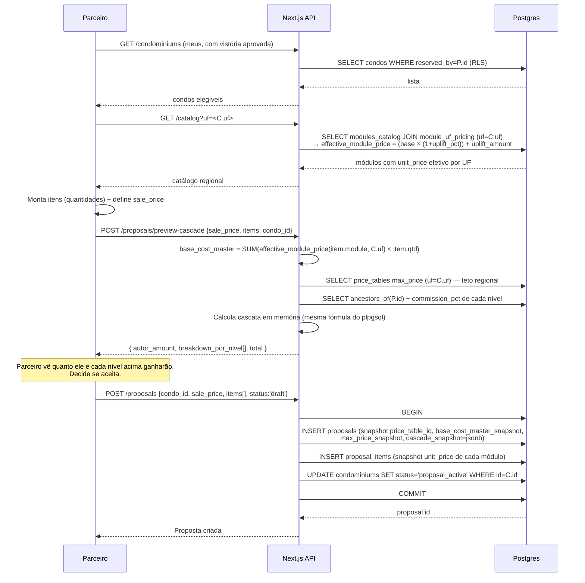
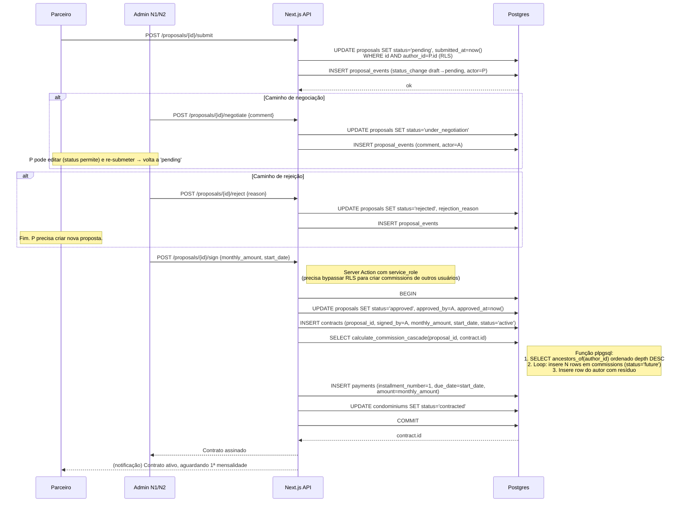
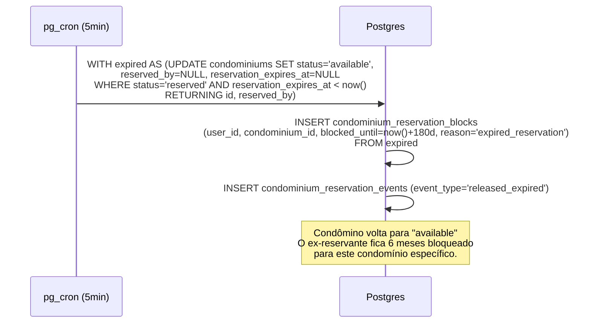
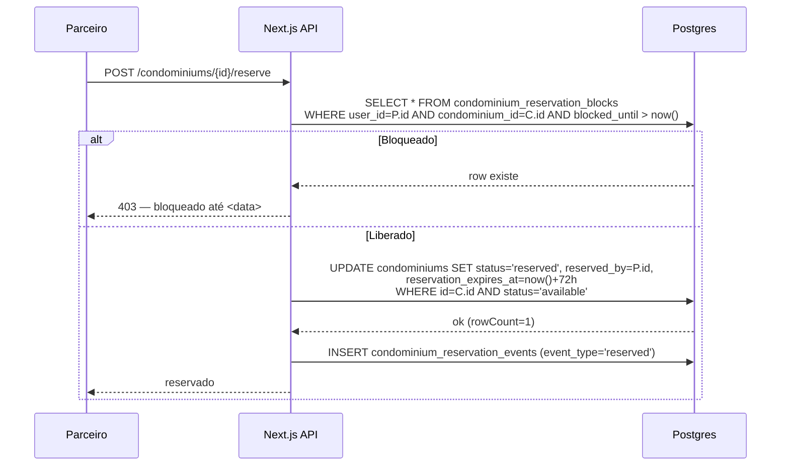
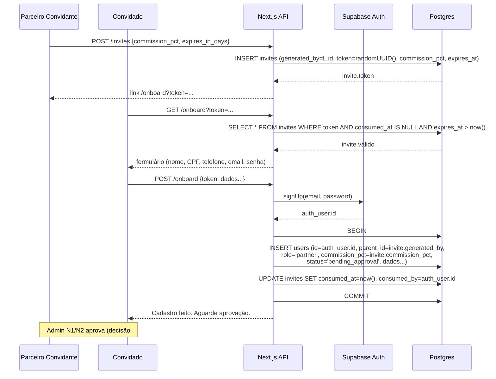

# Fluxos Críticos — Clique Retire Partners

> Diagramas de sequência dos caminhos felizes + variantes, usados para validar `DATA_MODEL.md` antes de qualquer código.
> Atores: **P** = Parceiro, **A1/A2/A3** = Admins, **API** = Next.js (route handlers / server actions), **DB** = Postgres/Supabase, **Cron** = pg_cron.
>
> **Multiempresa:** projeto Supabase dedicado (`condopartners`), sem prefixo. Toda tabela tem `tenant_id` e toda RLS é escopada por tenant; papel via `auth_role()`, tenant via `current_tenant_id()`. Ver `DATA_MODEL.md` §0.

---

## Fluxo 1 — Criação de Proposta com Preview da Cascata

**Pré-condições:** parceiro `P` autenticado; condomínio `C` com `reserved_by = P.id` e existe `inspection` com `status='approved'` para `C`.



**Pontos chave:**
- O **preview** é stateless: a API calcula sem persistir. Mesma função (`plpgsql` ou duplicada em TS) usada na assinatura, para garantir paridade.
- `cascade_snapshot` em `proposals` é o snapshot **da expectativa** no momento da criação (debug/exibição). A verdade contábil só nasce em `commissions` na assinatura.
- `proposal_items.unit_price` é snapshot de `effective_module_price(module_id, condo.uf)` — protege contra mudanças no catálogo ou no uplift entre criação e assinatura. `base_cost_master_snapshot` é a soma desses itens.

---

## Fluxo 2 — Submissão, Negociação e Assinatura



**Pontos chave:**
- Toda a assinatura é **uma transação** — falha em qualquer passo (insert de contrato, cascata, payment) aborta tudo.
- O `calculate_commission_cascade` ignora ancestrais com `role != 'partner'` (admins na árvore não entram). Ancestral **inativo** NÃO é falha: percorre a cascata normalmente, mas seu markup vira **house take** (linha em `commissions` com `beneficiary_id=NULL`, `role_in_sale='house'`) — receita absorvida pela Clique, invisível para parceiros. *(Decisão #3 — ver §"Decisões fechadas" e `DATA_MODEL.md` §6.)*
- 1ª `payment` é criada já no sign. Mensalidades 2+ ficam **fora do MVP** (decisão #1 — ver §"Decisões fechadas").

---

## Fluxo 3 — Pagamento da 1ª Mensalidade → Liberação de Comissões

```mermaid
sequenceDiagram
  participant A as Admin N2
  participant API as Next.js API
  participant DB as Postgres
  participant Trg as Trigger DB

  Note over A: Fora do sistema, mensalidade é cobrada e paga.<br/>Admin reconcilia manualmente.

  A->>API: POST /payments/{id}/mark-paid {paid_at}
  API->>DB: UPDATE payments SET paid_at=$, marked_paid_by=A.id WHERE id=$
  DB->>Trg: AFTER UPDATE on payments
  alt installment_number=1 AND old.paid_at IS NULL AND new.paid_at IS NOT NULL
    Trg->>DB: UPDATE commissions SET status='released', released_at=new.paid_at<br/>WHERE contract_id=$ AND status='future'
  end
  DB-->>API: ok
  API-->>A: 1ª mensalidade paga; N comissões liberadas

  Note over API: Eventos em tempo real (Supabase Realtime)<br/>notificam parceiros que viram "Saldo Liberado" subir.
```

**Pontos chave:**
- A trigger é a única fonte que muda `future → released`. Não há código na API fazendo isso.
- Pagamento de mensalidade 2+ não dispara nada (já está tudo `released`).

---

## Fluxo 4 — Cancelamento de Contrato

```mermaid
sequenceDiagram
  participant A as Admin N1
  participant API as Next.js API
  participant DB as Postgres

  A->>API: POST /contracts/{id}/cancel {reason}
  API->>DB: BEGIN
  API->>DB: SELECT status, has_first_payment FROM contracts JOIN payments<br/>WHERE id=$
  DB-->>API: estado atual

  alt 1ª mensalidade NÃO paga
    API->>DB: UPDATE commissions SET status='void' WHERE contract_id AND status='future'
    Note right of DB: Comissões nunca existiram financeiramente
  else 1ª mensalidade JÁ paga
    Note right of DB: commissions 'released' ficam intocadas<br/>(sistema é apenas controle; pagamento real é externo)
  end

  API->>DB: UPDATE contracts SET status='cancelled', cancelled_at, cancelled_by=A, cancellation_reason
  API->>DB: UPDATE condominiums SET status='available' (decisão #2)
  API->>DB: COMMIT
  API-->>A: Contrato cancelado
```

---

## Fluxo 5 — Expiração de Reserva + Anti-harding (pg_cron)



**Validação no momento de uma nova reserva:**



**Ponto crítico:** o `UPDATE ... WHERE status='available'` é a **trava de corrida**. Se dois parceiros tentam reservar simultaneamente, o primeiro `commit` ganha; o segundo retorna `rowCount=0` e a API responde 409.

---

## Fluxo 6 — Convite + Onboarding



---

## Decisões fechadas (rodada de buracos)

| # | Buraco | Decisão | Implicação técnica |
|---|---|---|---|
| 1 | Mensalidades 2+ | **Não modelar no MVP**. Cria-se só `installment_number=1` na assinatura. Pagamentos recorrentes ficam para fase futura ("controle financeiro completo"). | `payments` no MVP terá no máximo uma linha por contrato. Dashboards focam só na 1ª. |
| 2 | Condo após cancelamento | Volta para `available`. | Trigger/server-action de cancelamento faz `UPDATE condominiums SET status='available'`. Sem anti-harding extra. |
| 3 | Ancestral inativo na cascata | ~~Pula o nível~~ **REVISADO (3ª rodada): markup vira house take** (fica para a Clique). Linha em `commissions` com `beneficiary_id=NULL` e `role_in_sale='house'`. Parceiros não enxergam essa linha (RLS). | `calculate_commission_cascade` insere row `house` no lugar de skip. Garante que a árvore inteira percorre, ancestrais inativos não punem o autor nem outros líderes ativos. |
| 4 | Term natural do contrato | `pg_cron` diário: se `end_date < today` E `status='active'`, vira `terminated`. Contratos sem `end_date` ficam ativos até cancelamento explícito. | Novo job em `pg_cron`. |
| 5 | Aprovação de cadastro de parceiro | **Só N1/N2**. N3 fica focado em vistorias. | RLS de `users` na transição `pending_approval → active` exige `auth_role() IN ('admin_n1','admin_n2')`. |
| 6 | RLS de `commissions` para líder | Policy: `beneficiary_id IN (auth.uid() ∪ descendants_of(auth.uid()))`. UI esconde `markup_pct_applied`, `visible_base_at_level` quando `beneficiary_id != auth.uid()`. | Defesa em profundidade: RLS dá o macro (que rows vê), UI esconde o micro (campos sensíveis). |

Patches aplicados em `DATA_MODEL.md`:
- §5 `payments`: nota "MVP cria só installment 1".
- §6 `calculate_commission_cascade`: ancestral inativo gera linha `house` (não pula o nível).
- §7 `pg_cron`: novo job `terminate-expired-contracts` (diário).
- §8 RLS: política completa de `commissions` + nota sobre N3 não aprovar cadastros.

---

## Pendências

- **Setup do projeto Next.js + Supabase** (estrutura de pastas, ferramenta de migrations, seeds, envs).
- **Validação de constraints**: revisar todos os `UPDATE ... WHERE status=...` para garantir que a trava de corrida funciona em todos os pontos críticos (reserva, sign, cancel).

O mapa de telas por papel já existe em `SCREENS.md`.
